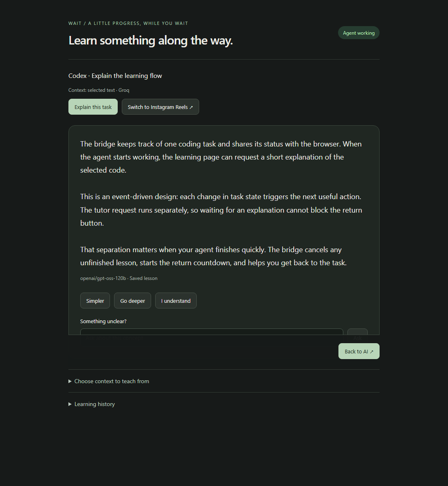

# wAIt

**Your agent is working. Make the wait yours.**

wAIt is a Windows companion for AI-assisted coding. While your agent works, watch Instagram Reels or get a short lesson about the code. When the agent needs you, wAIt locks new reels, gives you a short finish-up window, and helps you return to the task.

Built for **Antigravity / Codex → Windows → Opera GX**. **MIT licensed.**

[Get started](#get-started) · [Best PR challenge](#best-pr-challenge) · [How it works](docs/ARCHITECTURE.md) · [Contribute](CONTRIBUTING.md)

> **Experimental 0.1.0.** Antigravity + Opera GX has been exercised by the maintainer. Agent hooks and Instagram's page structure can change; see [current limits](#current-limits) before relying on automatic return.

## The idea

Waiting for an agent is easy. Remembering to stop scrolling when it finishes is harder.

wAIt connects the break to the task:

1. **Start a task.** A detected agent run opens a dedicated waiting window.
2. **Choose your break.** Learn about the code, or switch to your signed-in Instagram Reels feed.
3. **Get back to work.** When a stop or attention event arrives, new lessons and reels lock. The current reel can continue during a **15-second countdown**, if it can be identified safely. **Back to AI** returns immediately.
4. **Repeat.** The next detected run reopens the waiting window in your last mode.

The finish-reel button keeps the current clip available during the countdown; it does not extend the deadline. Other Instagram tabs are unaffected.

## Two ways to wait

| | Reels | Learn |
| --- | --- | --- |
| While the agent works | Scroll Instagram in a managed Opera GX window | Read a short, task-related explanation |
| When the agent stops | New reels lock; finish up within the countdown | New generation stops; the last lesson stays visible |
| What you need | Your own Instagram browser session | Your own Groq key and explicit context sharing |
| Extras | Finish-reel modal, playback controls, Back to AI | Simpler, Go deeper, questions, understanding feedback, local history |

Learn opens first. Choose **Switch to Instagram Reels** for the key-free flow; later runs remember that mode.



*Learn-page preview using synthetic test content, not a private project or conversation.*

## Get started

### Requirements

- Windows and Node.js **22.13 or newer**.
- Opera GX and an installed supported coding agent.
- Git if you want automatic recent-diff context for lessons.
- A Groq API key **only if you want Learn**. Scrolling needs no model API key.

### 1. Install and start the companion

Clone the repository and install from its folder:

```powershell
git clone https://github.com/Hudaifa-Ghula/wAIt.git
cd wAIt
npm ci
npm start
```

Keep that terminal open. `npm start` builds the extension and starts the local bridge. By default, it watches tasks in this project's folder.

### 2. Connect the agent and browser

In a second terminal in the same folder:

```powershell
npm run setup -- --install-hooks --link-browser
```

This backs up and updates your agent-hook configuration and registers the current user's browser native host. It does not grant the agent tool permissions. Opera's native-messaging registration shares Chrome's Windows registry location.

In Opera GX:

1. Open `opera://extensions` and enable **Developer mode**.
2. Select **Load unpacked**, then choose this repository's `dist/browser` folder.
3. Restart your coding agent so it loads the hooks.
4. Send a **new prompt** in the monitored project.

The extension has a stable ID; you do not need to copy it during normal setup. **Connected** means the browser can reach the bridge. A task still needs to start before the waiting window opens.

### 3. Watch your own project

Stop the companion, then start it with your project's path:

```powershell
npm start -- --project "D:\Projects\my-app"
```

Hooks filter events to that project. Browser registration continues to use this wAIt checkout. Use the popup to choose among detected conversations; one selected task controls the waiting window.

### Optional: enable lessons

Save your own Groq API key in a local `groqAPI.txt` file, then run:

```powershell
npm run setup:key
npm start -- --project "D:\Projects\my-app" --share-context
```

Stop an already-running companion before starting the second command. Setup encrypts the key with Windows DPAPI for your user. The original plaintext file remains ignored by Git; after verifying the setup works, you can remove it. Alternatively, provide `GROQ_API_KEY` to the companion process. `.env` files are not loaded automatically.

`--share-context` allows compact supported task prompts, recent code diffs, and text you select in Learn to be sent to Groq for the monitored project. If context is missing, use **Choose context to teach from**. The tutor uses `openai/gpt-oss-120b`; your account's limits and billing apply. wAIt does not purchase credits or upgrade plans.

## Privacy, in plain language

- Agent status goes through an authenticated **local loopback bridge** and browser native messaging.
- Teaching context is shared with Groq only when enabled. Common credential patterns are redacted, but you should still review what you share.
- Raw teaching context stays in bridge memory. Generated lessons and feedback are saved in local SQLite history and can contain details of your source.
- Instagram sign-in stays in your browser profile. wAIt does not copy social credentials into the tutor.
- Keys, connection credentials, history, logs, and machine-specific setup files belong outside Git. The manifest's `key` is a public key used for the extension ID, not a credential.

See [SECURITY.md](SECURITY.md) for data boundaries and private vulnerability reporting.

## Best PR challenge

**Make wAIt more useful. The best contribution wins platform access.**

Submit a PR that solves a meaningful problem or adds useful functionality. A well-tested reliability fix can win just as easily as a new feature. Think better task detection, clearer setup, accessible controls, or a smoother waiting experience.

- **Deadline:** end of **November 7, 2026**, Tripoli time (UTC+2). Submit before **00:00 on November 8**; entries are accepted throughout November 7.
- **Prize:** access to the creator's programming-learning platform, planned to launch in October 2026. The winner can keep the access or gift it to someone else. Platform name, link, access tier, and duration are TBA.
- **Selection:** the creator will judge, or use a community vote, depending on the submissions. The method will be announced before judging or voting begins.
- **What counts:** solving real problems, useful functionality, correctness, and maintainable work—not lines changed or PR volume.
- **No merge required:** a submitted PR can qualify and win even if it is not merged. The maintainer decides which changes enter the project.

The source is public; competition entries open after the remaining details are finalized and the opening is announced. Read the [challenge details and announcement](docs/PR-CHALLENGE.md) and [contribution guide](CONTRIBUTING.md). AI-assisted PRs are welcome when you understand and validate the work.

## How it fits together

```text
Agent hooks → local Node.js bridge → native messaging → browser extension
                       ├─ optional Groq tutor + local lesson history
                       └─ Windows helper to return to the agent
```

| Folder | What lives there |
| --- | --- |
| `src/core/` | Task state, run identities, and stale-event protection |
| `src/adapters/` | Agent hooks, project filtering, and event normalization |
| `src/bridge/` | Local API, native host, tutor, SQLite history, and window helpers |
| `extensions/browser/` | Popup, Learn page, Reels modal, and feed guard |
| `extensions/vscode/` | Optional VS Code development integration |
| `scripts/` | Setup, build, diagnostics, packaging, and public-file audit |
| `tests/` | Backend, lifecycle, and headless-browser regression tests |

See the [architecture guide](docs/ARCHITECTURE.md) for the full event flow.

## Development

```powershell
npm ci
npx playwright install chromium
npm run check
npm run audit:public
```

The tests use synthetic events, mocked model calls, and an isolated headless browser. No API key or Instagram login is required. Changes to browser code require reloading the extension at `opera://extensions` and refreshing its managed pages.

| Command | Purpose |
| --- | --- |
| `npm run build` | Build `dist/browser` and `dist/vscode` |
| `npm run check` | Build and run the full regression suite |
| `npm run test:browser` | Run the controlled browser fixtures |
| `npm run diagnose` | Inspect hook delivery, task state, and recent event decisions |
| `npm run audit:public` | Check publishable files for credential patterns and private paths |
| `npm run audit:public -- --staged` | Check the exact contents of the Git index before committing |
| `npm run package` | Build the optional VS Code development package |

`node scripts/test-groq.mjs` makes a **live** request with synthetic sample code and your configured key. It is separate from the normal test suite.

## Troubleshooting

| Symptom | First check |
| --- | --- |
| Connected, but nothing opens | Send a new prompt in the project printed by `npm start`, then run `npm run diagnose` |
| Task status is stuck or a stop is missed | Keep the bridge running and inspect `npm run diagnose`; the event history distinguishes delivered from rejected events |
| Antigravity reports a truncated module path | Run `npm run setup -- --repair-antigravity`, then restart Antigravity |
| Browser changes do not appear | Rebuild, reload the extension, and refresh the managed Reels/Learn page |
| Learn cannot generate | Check the Groq key, `--share-context`, available context, and account limits |
| Return does not focus the agent | Use the taskbar; Windows can reject foreground activation |

Use one bridge/registration at a time. Advanced `--data-dir` overrides require matching hook and native-host registration paths. Nothing installs a background startup service automatically.

## Current limits

- **Host events are imperfect.** Antigravity can cancel a Stop hook before delivery. Hooks do not expose every approval or input-wait state. There is no tested visual stop-button fallback.
- **Instagram can change.** Automated tests cover controlled DOM fixtures, not every version of the live site. If wAIt cannot safely identify the current video, it pauses rather than allowing a different reel.
- **Windows focus is best-effort.** The return helper validates the original process/window, but the OS can refuse activation.
- **This is a Windows-first source release.** The optional VS Code package needs separate clean-install validation. macOS/Linux support is not implemented.

The application targets Codex and Antigravity hooks; this does not guarantee compatibility with every release of either host. Live integration checks complement the automated tests.

## License

[MIT](LICENSE). Contributions are welcome under the same license. See the [release checklist](docs/RELEASE.md) for launch preparation.
