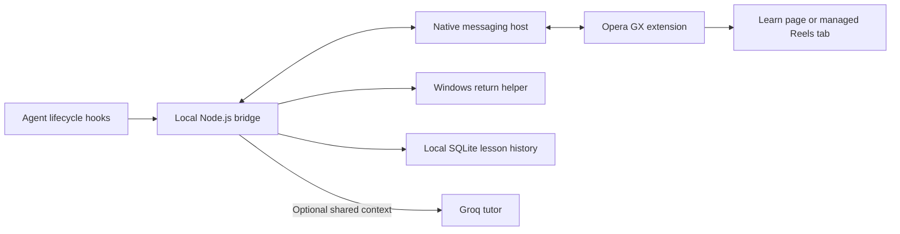

# How wAIt works

The idea is simple: while a coding agent works, you can learn about the task or watch Reels. When the agent needs you, wAIt closes the break and helps you return. It does not run the coding agent itself.

## One task from start to return

1. An installed agent hook launches a small CLI with lifecycle JSON on stdin. The CLI checks the project, keeps only supported event metadata, and sends it to the authenticated local bridge. Context is collected only when sharing is enabled.
2. The adapter normalizes provider-specific events into starts, activity, stops, errors, or requests for attention. The store assigns state to a conversation and a particular run. Only the selected conversation drives the browser.
3. The native host streams snapshots to the extension. The first task opens Learn; choosing Reels makes subsequent tasks reuse that mode and managed window.
4. A stop/attention event locks new lessons and new reels. The bridge sets a 15-second return deadline. If the current reel can be identified, the modal lets it continue during that countdown; it does not promise to play beyond the deadline.
5. The deadline or Back to AI pauses/mutes the managed media and requests focus on the captured agent window. A fresh observed run reopens the waiting session. Old run events and timers should never control the new run.

## File map

| Area | Purpose |
| --- | --- |
| `src/core/store.mjs` | Selected task, run identity, state transitions, event deduplication |
| `src/adapters/` | Provider normalization, project filtering, hook CLI and command generation |
| `src/bridge/server.mjs` | Authenticated local HTTP/SSE API, countdown, tutor coordination |
| `src/bridge/native-host.mjs` | Browser native-messaging protocol |
| `src/bridge/tutor.mjs`, `context.mjs`, `db.mjs` | Groq requests, redaction, and lesson memory |
| `extensions/browser/worker.js` | Managed window, reconnects, snapshots, and return timers |
| `extensions/browser/content-controller.mjs` | Reels identification, modal, navigation lock and playback guard |
| `extensions/browser/learn.*` | Lesson UI and feedback |
| `extensions/vscode/` | Optional development integration |
| `scripts/` | Build, Windows setup, diagnostics, packaging, public-file audit |
| `tests/` | State, bridge, hooks, model mocks, and headless browser fixtures |

## What it does not guarantee

Antigravity can cancel a Stop hook before it delivers an event. Hooks do not expose every approval or input-wait state. Instagram can change its DOM; ambiguous players are paused rather than guessed. Windows can refuse foreground activation. The current implementation has no tested visual stop-button fallback and is not cross-platform.

The development tests need no live service credentials. They are valuable regression coverage, but cannot establish compatibility with every agent version or the live Instagram website.
